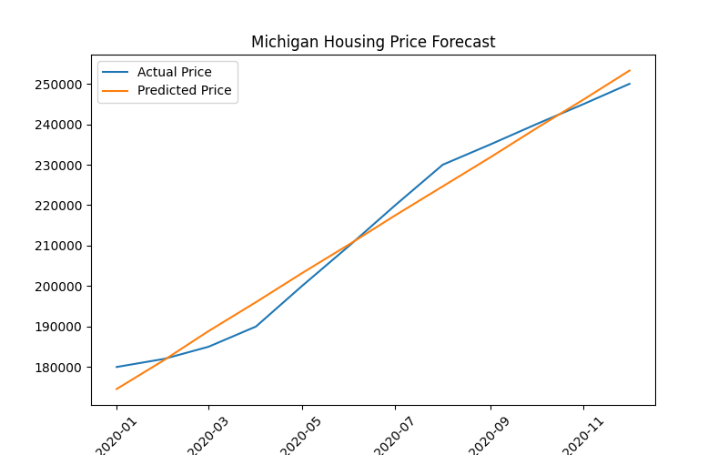

# Michigan Housing Forecasting

This project analyzes housing price trends in Michigan and builds a forecasting model to estimate median housing prices over time.

---

## Project Overview

The goal of this project is to understand Michigan housing market trends using historical data and create a simple predictive model that forecasts housing prices.

The project includes:

- Data cleaning and preprocessing
- Exploratory data analysis
- Feature engineering
- A baseline machine learning model
- Forecast visualization

---

## Forecast Visualization



---

## Tech Stack

- Python
- Pandas
- Scikit-learn
- Matplotlib
- Jupyter Notebook

---

## Project Structure

```
michigan-housing-forecasting
│
├── data
│   └── raw
│       └── michigan_housing.csv
│
├── notebooks
│   ├── 01_data_cleaning.ipynb
│   ├── 02_eda.ipynb
│   └── 03_modeling.ipynb
│
├── src
│   ├── preprocess.py
│   ├── features.py
│   ├── train.py
│   └── evaluate.py
│
├── outputs
│   ├── figures
│   │   └── housing_forecast.png
│   └── predictions
│       └── housing_predictions.csv
│
├── README.md
└── requirements.txt
```

---

## Model

A **Linear Regression model** is used as a baseline forecasting model.  
The model predicts median housing prices based on time-based features.

---
outputs/figures/housing_forecast.png

## Results

The model captures the upward trend in Michigan housing prices and produces predicted price estimates over time.

Prediction outputs are saved in:

```
outputs/predictions/housing_predictions.csv
```

---

## Future Improvements

Possible improvements include:

- Time series forecasting using ARIMA or Prophet
- Additional economic indicators (interest rates, CPI, unemployment)
- County-level or city-level housing forecasts
- More advanced machine learning models